# Commercial Data Engineering Pipeline

A production-ready data pipeline built with Prefect that processes restaurant data through a three-layer medallion architecture. Handles CSV files and Azure Blob Storage data, performing automated ETL to generate business insights.

**Author:** Samiksha Dhere
**Course:** MSc ADSA - Data Management 2
**Date:** November 2025

---

## Table of Contents

1. [Architecture](#architecture)
2. [Setup](#setup)
3. [How to Run](#how-to-run)
4. [Layer-Specific Documentation](#layer-specific-documentation)
5. [Analytics Outputs](#analytics-outputs)
6. [Troubleshooting](#troubleshooting)

---

## Architecture

The pipeline follows a medallion architecture with three distinct layers:

```mermaid
graph TB
    subgraph Sources["Data Sources"]
        CSV["CSV Files<br/>(6 files)<br/>customers, orders,<br/>products, items,<br/>stores, supplies"]
        Azure["Azure Blob Storage<br/>(JSONL)<br/>500K support tickets"]
    end

    subgraph Bronze["🥉 Bronze Layer - Raw Data Ingestion"]
        B1["Ingest CSV Files"]
        B2["Download JSONL<br/>from Azure"]
        B3["Save Raw Data<br/>data/bronze/"]
    end

    subgraph Silver["🥈 Silver Layer - Data Cleaning & Transformation"]
        S1["Clean Data<br/>- Remove duplicates<br/>- Handle missing values<br/>- Standardize formats"]
        S2["Transform Data<br/>- Normalize columns<br/>- Type conversions<br/>- Data validation"]
        S3["Save Cleaned Data<br/>data/silver/"]
    end

    subgraph Gold["🥇 Gold Layer - Analytics & Insights"]
        G1["Calculate Metrics<br/>- Average Order Value<br/>- Tickets per Order<br/>- Revenue Analytics"]
        G2["Generate Reports<br/>- Restaurant Summary<br/>- Ticket Analytics<br/>- Overall Metrics"]
        G3["Save Analytics<br/>data/gold/"]
    end

    subgraph Output["Analytics Outputs"]
        O1["average_order_value.csv"]
        O2["tickets_per_order.csv"]
        O3["restaurant_summary.csv"]
        O4["ticket_analytics.csv"]
        O5["overall_metrics.csv"]
    end

    CSV --> B1
    Azure --> B2
    B1 --> B3
    B2 --> B3

    B3 --> S1
    S1 --> S2
    S2 --> S3

    S3 --> G1
    G1 --> G2
    G2 --> G3

    G3 --> O1
    G3 --> O2
    G3 --> O3
    G3 --> O4
    G3 --> O5

    style Sources fill:#e1f5ff
    style Bronze fill:#cd7f32,color:#fff
    style Silver fill:#c0c0c0
    style Gold fill:#ffd700
    style Output fill:#90EE90
```



### Data Flow

**Bronze Layer** → Ingests raw data from CSV files and Azure Blob Storage without any transformations
**Silver Layer** → Cleans data by removing duplicates, handling missing values, and standardizing formats
**Gold Layer** → Generates business analytics and insights from cleaned data

---

## Setup

### Prerequisites
- Python 3.8 or higher
- Git (for cloning the repository)
- Internet connection (for Azure Blob Storage access)

### Step 1: Clone the Repository

```bash
git clone <your-repository-url>
cd restaurant-analytics-pipeline
```

### Step 2: Create Virtual Environment

Creating a virtual environment keeps dependencies isolated:

```bash
# Create virtual environment
python -m venv venv

# Activate it
# On Mac/Linux:
source venv/bin/activate

# On Windows:
venv\Scripts\activate
```

You should see `(venv)` in your terminal prompt after activation.

### Step 3: Install Dependencies

```bash
pip install -r requirements.txt
```

This installs:
- **Prefect 2.x** - Workflow orchestration
- **Pandas** - Data processing
- **Azure Storage Blob** - Cloud data access
- **python-dotenv** - Environment variable management

### Step 4: Configure Environment Variables

The pipeline needs Azure credentials to download support ticket data. These are stored securely in a `.env` file.

```bash
# Copy the example file
cp .env.example .env
```

Then edit `.env` and add your Azure credentials:

```bash
# Open .env in your text editor
nano .env  # or use any text editor
```

Set these variables:
```
AZURE_BLOB_URL=https://your-storage-account.blob.core.windows.net/your-container
AZURE_SAS_TOKEN=your-sas-token-here
```

**Note:** The `.env` file is already configured with working credentials for this project. If you're replicating this, you'll need your own Azure SAS URL and token.

### Step 5: Verify Setup

```bash
python -c "import prefect, pandas; print('Setup complete!')"
```

If you see "Setup complete!" without errors, you're ready to run the pipeline.

---

## How to Run

### Option 1: Run Pipeline Directly (Command Line)

This runs the pipeline and shows results in your terminal:

```bash
python main_flow.py
```

You'll see:
- Progress logs for each layer (Bronze → Silver → Gold)
- Analytics summary with key metrics
- File locations for all outputs

**Expected runtime:** 5-6 minutes (depending on internet speed for Azure download)

### Option 2: Run with Prefect UI (Recommended for Visualization)

Prefect provides a web-based UI to visualize your pipeline execution in real-time.

#### Step 1: Start Prefect Server

Open a new terminal window and run:

```bash
# Activate your virtual environment first
source venv/bin/activate  # Mac/Linux
# or
venv\Scripts\activate  # Windows

# Start Prefect server
prefect server start
```

Keep this terminal running. You should see:
```
Prefect server running at http://127.0.0.1:4200
```

#### Step 2: Open Prefect UI in Browser

Open your web browser and go to:
```
http://127.0.0.1:4200
```

You'll see the Prefect dashboard with a clean UI showing:
- Flow runs
- Task execution status
- Logs and metrics
- Execution timeline

#### Step 3: Run the Pipeline

In a **new terminal** (keep the server running), activate your venv and run:

```bash
source venv/bin/activate  # Mac/Linux
python main_flow.py
```

#### Step 4: View Pipeline in Browser

Go back to your browser (http://127.0.0.1:4200) and:

1. Click on **"Flow Runs"** in the left sidebar
2. You'll see your pipeline run: **"Restaurant Analytics Pipeline - End to End"**
3. Click on it to see:
   - Real-time task execution
   - Task dependencies (Bronze → Silver → Gold)
   - Logs for each task
   - Execution timeline
   - Success/failure status

The UI shows a visual graph of your pipeline with color-coded tasks:
- 🟢 Green = Completed successfully
- 🔵 Blue = Running
- 🔴 Red = Failed
- ⚪ Gray = Pending

#### Step 5: Stop Prefect Server

When you're done, go back to the terminal running the Prefect server and press `Ctrl+C` to stop it.

### What Gets Generated

After running the pipeline, you'll have:

**Bronze Layer** (`data/bronze/`):
- 6 CSV files (raw data)
- 1 JSONL file (500K support tickets from Azure)

**Silver Layer** (`data/silver/`):
- 7 cleaned CSV files

**Gold Layer** (`data/gold/`):
- 5 analytics CSV files (see [Analytics Outputs](#analytics-outputs))

---

## Layer-Specific Documentation

Each layer has detailed documentation explaining what it does, how it works, and how to troubleshoot issues:

- **[Bronze Layer Documentation](data/bronze/README.md)** - Raw data ingestion from CSV and Azure
- **[Silver Layer Documentation](data/silver/README.md)** - Data cleaning and transformation
- **[Gold Layer Documentation](data/gold/README.md)** - Analytics and business insights

These docs include:
- Detailed explanations of each transformation
- Input/output file schemas
- Data quality metrics
- Troubleshooting guides

---

## Analytics Outputs

The pipeline generates 5 analytics files in `data/gold/`:

### 1. `average_order_value.csv`
Customer-level spending analysis.

**Columns:** `customer`, `total_orders`, `total_spent`, `average_order_value`

**Use Case:** Identify high-value customers, segment by spending behavior

### 2. `tickets_per_order.csv`
Support ticket volume per order.

**Columns:** `order_id`, `customer`, `order_total`, `ticket_count`, `ordered_at`

**Use Case:** Find problematic orders, correlate order value with support needs

### 3. `restaurant_summary.csv`
Comprehensive order and ticket summary.

**Columns:** `order_id`, `customer`, `order_total`, `ordered_at`, `ticket_count`, `avg_order_value`

**Use Case:** Complete customer behavior analysis

### 4. `ticket_analytics.csv`
Support ticket breakdown by category.

**Columns:** `issue_type`, `ticket_count`, `percentage`

**Use Case:** Identify top support issues, prioritize improvements

### 5. `overall_metrics.csv`
High-level business KPIs.

**Columns:** `metric`, `value`, `total_revenue`, `total_orders`

**Use Case:** Executive dashboard, performance tracking

**Current Metrics:**
- Average Order Value: $1,045.77
- Total Revenue: $66M+
- Total Orders: 63,148
- Support Tickets: 500,000

---

## Troubleshooting

### Issue: "Azure credentials not found"

**Solution:**
1. Check that `.env` file exists in project root
2. Verify `AZURE_BLOB_URL` and `AZURE_SAS_TOKEN` are set
3. Make sure there are no extra spaces or quotes around values

### Issue: "CSV files not found"

**Solution:**
1. Ensure CSV files are in `data/source_csv/` folder
2. Check file names match exactly:
   - `raw_customers.csv`
   - `raw_orders.csv`
   - `raw_products.csv`
   - `raw_items.csv`
   - `raw_stores.csv`
   - `raw_supplies.csv`

### Issue: "Module not found" errors

**Solution:**
1. Activate your virtual environment: `source venv/bin/activate`
2. Reinstall dependencies: `pip install -r requirements.txt`

### Issue: Prefect UI not loading

**Solution:**
1. Check Prefect server is running: `prefect server start`
2. Try a different port if 4200 is busy: `prefect config set PREFECT_SERVER_API_PORT=4201`
3. Clear browser cache and refresh

### Issue: Pipeline runs but no analytics generated

**Solution:**
1. Check Silver layer completed successfully (check `data/silver/` for files)
2. Review logs for errors in Gold layer tasks
3. Verify Silver files have data (not empty)

### Issue: Azure download is slow

**Cause:** Downloading 500K records takes time (3-5 minutes)

**Solution:** This is normal. The download shows progress in logs. Be patient.

---

## Project Structure

```
restaurant-analytics-pipeline/
├── README.md                    # This file
├── .env                         # Azure credentials (not in git)
├── .env.example                 # Template for .env
├── .gitignore                   # Git ignore rules
├── requirements.txt             # Python dependencies
├── main_flow.py                 # Main pipeline orchestration
├── data/
│   ├── source_csv/              # Your CSV files go here
│   ├── bronze/                  # Raw data (generated)
│   │   └── README.md            # Bronze layer docs
│   ├── silver/                  # Cleaned data (generated)
│   │   └── README.md            # Silver layer docs
│   └── gold/                    # Analytics (generated)
│       └── README.md            # Gold layer docs
├── flows/
│   ├── __init__.py
│   ├── ingest_data.py           # Bronze layer tasks
│   ├── transform_data.py        # Silver layer tasks
│   └── analytics.py             # Gold layer tasks
└── utils/
    ├── __init__.py
    ├── azure_utils.py           # Azure Blob Storage helpers
    └── transformations.py       # Data cleaning functions
```

---

## Technologies Used

- **Python 3.8+** - Programming language
- **Prefect 2.x** - Workflow orchestration and monitoring
- **Pandas** - Data manipulation and analysis
- **Azure Blob Storage** - Cloud data storage
- **python-dotenv** - Environment variable management

---

## Key Features

✅ **Automated ETL** - Runs end-to-end without manual intervention
✅ **Scalable Architecture** - Medallion design supports growing data volumes
✅ **Cloud Integration** - Seamlessly downloads data from Azure
✅ **Data Quality** - Automated cleaning, validation, deduplication
✅ **Visual Monitoring** - Prefect UI for real-time pipeline visualization
✅ **Reproducible** - Environment variables and venv ensure consistency
✅ **Well-Documented** - Layer-specific docs and inline code comments

---

## Academic Context

This project demonstrates key data engineering concepts:

- **ETL Pipeline Design** - Extract, Transform, Load pattern
- **Medallion Architecture** - Bronze/Silver/Gold layered approach
- **Workflow Orchestration** - Using Prefect for task management
- **Cloud Data Integration** - Azure Blob Storage with SAS authentication
- **Data Quality Management** - Cleaning, validation, standardization
- **Modular Code Design** - Separation of concerns, reusable functions

---

## License

This project is for academic purposes as part of MSc ADSA coursework.

---

## Contact

**Samiksha Dhere**
MSc ADSA - Data Management 2

